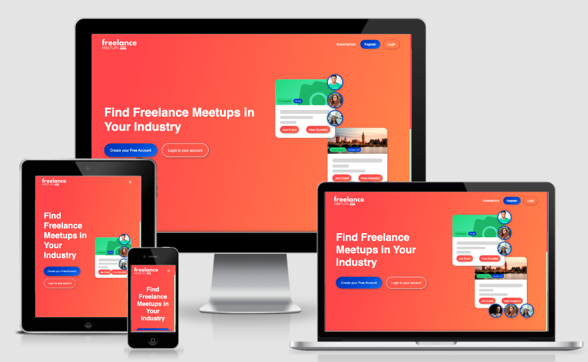
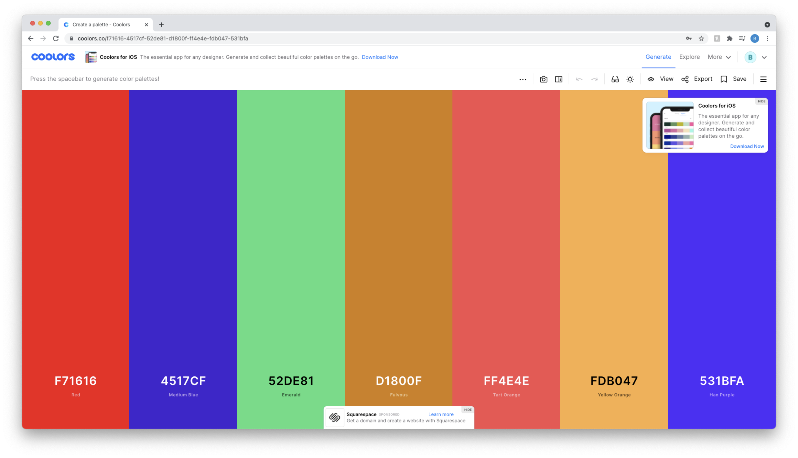
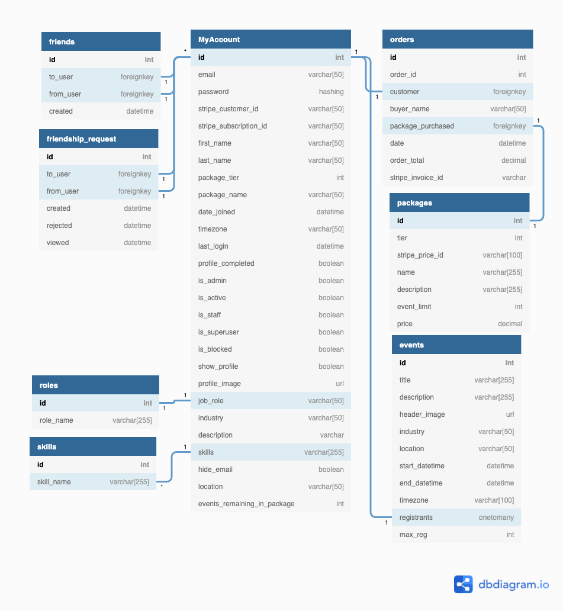

# FreelanceMeetups

[You can view the live site here](https://bc-freelance-meetups.herokuapp.com)

This site is intended to enable Freelancers from a number of industries to connect, and join their peers in Freelance Meetups online and in locations local to them.

By facilitating Freelancer connections and Meetups, the site aims to assist them in expanding their networks, to share advice and ideas, as well as well discover more work opportunities available to them.
___

## Contents
### [User Stories](#user-stories)
### [User Experience Design](#user-experience-design-1)
- Brand and Colours
- UI Design
- Wireframes
- DB Schema
### [Features](#features-1)
### [Technology & Tools](#technology--tools-1)
### [Testing](docs/testing.md) (separate page)
- User Stories
- Technical Testing
    - Code Validators
    - Responsive Design 
    - Compatability (Browser & Device)
    - Bugs & Known Issues
### [Local & Production Deployment](#deployment)
- Github
- Deploying to Heroku
- Connecting Production Environment to AWS
### [Credits](#credits-1)
- Tutorials & Support
- Images & Attribution
- Acknowledgements

 

___
 

## User Stories

- As a **first time user** I want to:
    - Be able to easily navigate the site and register before committing to a monthly subscription.
    - Quickly identify the benefits of signing up for a paid membership.
    - Evaluate the difference in subscriptions and best suited to my needs.

 

- As a returning **Freelancer** I want to:
    - Create a user profile so other users can find me and connect with me.
    - Add my skills and role to my profile to highlight to other users what my expertise is and what I may have in common with them.
    - Add my location to my profile so I can see events nearby to me vs events I would be unable to attend.
    - Be able to hide my profile to remain anonymous to other users if I do not want to be contacted or connected with.
    - Be able to subscribe to a monthly subscription and have access to membership only features like events and user connections.
    - Be able to upgrade my subscription to have access to increased feature allowances such as more event attendance.
    - Be able to downgrade my subscription to stop any further costs being charged to my credit card.
    - Securely submit my card details when completing an order to be confident that my credit card details are stored safely in line with security best practice.
    - Be able to view my past transactions to see my previous usage and billing summary.
    - Download invoices of my past payments	and have a copy of proof of purchase for my records.
    - Register and unregister for Meetups I am interested in.
    - See who is attending events I am attending.
    - Connect with other users.
    - Message other users once connected.
    - Approve or decline connection requests sent to me.

 

- As a **Site Owner** I want to:
    - Manage users via an admin CMS.
    - Manage events via an admin CMS.
    - Access order details for customers.
    - Enable users to contact me if there are any issues with their account.
    - Require users to verify their email before registration is confirmed.
    - Only show user accounts if users have completed their profiles, so only content rich information is shown to other users.

 

___
 

## **User Experience Design**

To encourage a positive first impression on users as they visit the site, it is important that the colours and UI design reflect those which the users are familiar with through similar sites, or provoke a strong enough emotional response for the user to be persuaded to click and spend their time on the site.

 

### **Colours & Typography**
The colours and typography in this site were selected based on research into colour theory, and knowledge of the target user base.

Using [Coloors](https://coloors.com), complimentary colours were selected that instill a feeling of creativity (oranges and pinks), excitement (reds, oranges), but also of loyalty and reliability (blues, greens).

These colours are then used throughout the site, set as CSS variables in the `base.css` file, as primary, secondary, accent and neutral colours, to ensure consistency in design.

An example of the final colour palette can be seen below:

In addition to the colours selected, the Google font 'Poppins' has been used across the site. This sans-serif font provides a contemporary, yet bold and impactful font-face that users can easily read, whilst preventing compact blocks of text. 

 

### **Wireframes**

Click below to view the wireframes created during the design phase of this project.

- [Click here for the desktop wireframe](docs/wireframes/Desktop.png)
- [Click here for the tablet wireframe](docs/wireframes/Tablet.png)
- [Click here for the mobile wireframe](docs/wireframes/Mobile.png)

 

### **Database Schema**
The database model is designed centrally around the MyAccount 'users' model. This table is extended from [Django-Allauth](https://django-allauth.readthedocs.io/en/latest/index.html), which handles user authentication, email and password verification, as well as password reset.

Extending the Allauth base model allows this site to add additional fielda on registration, such as First and Last Name.

Alongside the `users` model, the `friends`, `friendship`, `orders`, `packages`, `roles`, `skills` and `events` tables are then created. As shown in the diagram below, the tables are linked through one-to-one (ForeignKey) and one-to-many relationships, identified by: 

1 ----- 1 (One-to-One Relationship)  
1 ----- * (One-to-Many Relationship)

 

 

___
 

## **Features**

- Sitewide 
    - User account creation, authentication and verification through Allauth Django app.
    - User industry select to filter other users and events by most relevance.
    - Automated password reset through Allauth app.
    - User profile can be updated and viewed by others.

 

- Homepage
    - Clear call to action and information on what the site content is.
    - Clearly identifiable action buttons encouraging users to register or login.
    - Three distinct subscription types presented to users outlining key features of each type.

 

- My Dashboard Area
    - Summary of number of connections made, and events outstanding in package. 
    - Clear, actionable pending connections with ability to accept, decline or view users requests.
    - Summary of events registered for, including ability to cancel registration, or view more information.
    - Sidenav section for quick link access to dashboard, orders, edit profile and logout.

 

- Edit Profile
    - Allow users to update their profile image and preview before submitting the form.
    - Allow users to edit their information on their profile and add or remove skills.
    - Gives the ability for users to hide their profile from others.

 

- My Orders
    - Show users their previous orders collected through Stripe.
    - Enable users to download their latest invoices from Stripe.
    - Allow users quick access to upgrade their package through CTA button.

 

- Package Selection & Order Confirmation
    - Provides users with three clear packages, outlining the features and costs of each.
    - Offers secure Stripe element to collect card information and pass through to Stripe, without storing in site database.

 

- Freelancer and Meetups listings
    - Users are able to search other users and meetups from the listings pages and interact with them on the page.
    - Allow users to connect, disconnect and send messages to users on the user listings page.
    - Allow users to filter by their connections only on the listings page.
    - Allow users to register for events on the listings page, so long as they have the allowance.
    - Allow users to see other attendees attending events. 

 

- Admin
    - Ability to manage users, orders and events from the Django admin.
    - Ability to create, edit and delete events directly from the meetups listings page.

 

### Features for future release
- User chat function using websockets, removing need for email messaging.
- User discussion board and activity feed.
- Ability for users to add meetups and have them verified based on package type.
- Provide more role types allowing users to verify and moderate others.

 

___
 

## **Technology & Tools**

### **Technology**
- HTML5
- CSS
- Javascript - vanilla and jQuery
- Python3
- [Django 3.2](https://docs.djangoproject.com/en/3.2/)
- [Stripe API](https://stripe.com/docs)

### **Libraries**
- [Multiselect JS Library by sa-si-dev](https://github.com/sa-si-dev/virtual-select). Used to created multi and single select dropdowns with customised UI on forms.
- [Javascript Cookie Library by 'js-cookie' on GitHub](https://cdn.jsdelivr.net/npm/js-cookie@3.0.0/dist/js.cookie.min.js), used to simplify the retrieval of cookies when sending ajax requests (i.e setting the CSRF token as a variable within JS file).

### **Additional Tools**
- [Django Secret Key Generator](https://miniwebtool.com/django-secret-key-generator/) for generating Django secret key to store in environment variables in Gitpod and Heroku
- [temp-email.org](https://temp-mail.org/) used for generating temporary emails for demo user accounts.
- [JSON Generator](https://www.json-generator.com/) to create randomised user data for demo user testing.
- [Randomuser.me](https://randomuser.me/) to create randomised user profile images for demo user testing.
- [AMI Responsive](http://ami.responsivedesign.is/) used to get screenshot across browsers.

 

___
 

## **Testing**

The testing documentation is housed on a separate page. [Click here to access](docs/testing.md).

 

___
 

## **Deployment**

FreelanceMeetups is developed using VSCode, with version control in GitHub and deployed to Heroku and AWS for production.

### Github
To fork the repo, click the 'code' dropdown in the top right corner above the commit history on this page.
Copy and paste the HTTPS URL into a new CLI, once navigated to the folder you wish to clone the repo into.
Run `git clone [COPIED URL]`
This command will have saved the repository in the folder path you selected, enabling you to run a local server and launch the app.

### Deploy to Production environment in Heroku
1. Navigate to Heroku dashboard and click 'create new app' from the dropdown option.
#### Provision a new Postgres database in production
2. Under the 'Resources' tab, provision a new Postgres database (select the 'hobby' plan when prompted).
3. On the CLI in your development environment, install the following modules:
`pip3 install dj_database_url` and `pip3 install psycopg2-binary` 
4. Add the modules to your dependencies file with: 
`pip3 freeze --local > requirements.txt`
5. In **settings.py**:
    a. Import the module `import dj_database_url`. 
    b. Find and copy the `DATABASE_URL` Config Var in Heroku by clicking 'settings' then 'Reveal Config Vars'.
    c. Configure the **DATABASES** settings with the value copied from Heroku: 
    `DATABASES = {
        'default': dj_database_url.parse('YOUR CONFIG VAR VALUE HERE')
     }`
6. With the new database connected, apply the outstanding migrations to the new database with `python3 manage.py migrate`.
7. Load development data into the new database with `python3 manage.py loaddata YOUR_APP_NAME`
8. Install **gunicorn** to act as web server - `pip3 install gunicorn`.
9. Add the modules to your dependencies file with: 
`pip3 freeze --local > requirements.txt`
10. Create a new **Procfile** in the root directory and add instructions to start a new web Dyno on Heroku: `web: gunicorn YOUR-DJANGO-PROJECT.wsgi:application`
11. Log into Heroku with `heroku login -i`
12. Disable Heroku from collecting static files by entering this into the CLI: `heroku config:set DISABLE_COLLECTSTATIC=1 --app YOUR-HEROKU-APP-NAME`
13. Add Heroku to the 'ALLOWED_HOSTS' list in **settings.py**: `ALLOWED_HOSTS = ['YOUR-HEROKU-APP-NAME.herokuapp.com']`
14. After committing and pushing changes to GitHub, connect your GitHub repo to Heroku with `heroku git:remote -a YOUR-HEROKU-APP-NAME` and push to the Heroku deployment with `git push heroku main`.
15. Setup auto-deploy from GitHub in Heroku by clicking on the 'Deploy' tab, select 'GitHub', search for your respository, click 'connect' and then 'Enable Automatic Deploys'.
16. Generate a new Django SECRET_KEY using a key generator and add to Heroku - select 'settings', 'Reveal Config Vars' and add a new key 'SECRET_KEY' and value as the generated key. 

#### Setting up AWS to host static files and media
1. Signup for a free [AWS account](https://aws.amazon.com/) or login.
2. In the services searchbar at the top, type and select 'S3'.
3. Create a new 'bucket'. Use your Heroku app name to ensure it is clearly identifiable.
4. Select the region closest to you, uncheck the 'Block all public access' box and check the acknowledgement box at the bottom. Finally select 'create bucket'.
5. Configure the new bucket - click into the bucket and select the 'Properties' tab, and 'Static website hosting' option to create a new endpoint (enter default values into the prompts and click save).
6. Under the 'Permissions' tab, update the CORS configuration, by adding the below snippet: `[
  {
      "AllowedHeaders": [
          "Authorization"
      ],
      "AllowedMethods": [
          "GET"
      ],
      "AllowedOrigins": [
          "*"
      ],
      "ExposeHeaders": []
  }
]`
7. Under 'Bucket Policy' select 'Policy Generator' at the bottom of the editor to create a new policy for the bucket:
    a. Select 'S3 Bucket Policy' as the type
    b. Use '*' to allow all principals
    c. Select 'Get Object' as the **action**
    d. Paste in the **ARN** found at the top of the 'Bucket Policy Editor' tab. 
    e. Click add policy, then 'generate policy', finally copy and paste the generated policy into the policy editor on the previous page.
    f. Before saving changes, allow all resources by adding `/*` to the end of the 'Resources' value. e.g `"Resource": "arn:aws:s3:::YOUR-BUCKET-NAME/*"`
8. Finally, set the access control to public for this bucket by clicking 'Access Control List', then selecting 'Everyone (and list objects)' under 'Public Access'.

Create a new user and to access the bucket under 'IAM' management 
1. Back in the services menu, select 'IAM'
2. Under 'User Groups' create a new group with the name of the Django Project.
3. Create a new group policy by selecting 'Polices' on the left pane, and 'Create Policy'
    a. Select 'JSON' tab, and click 'Import managed policy'
    b. Search for 'S3' and select 'S3 Full Access Policy'
    c. To restrict access to the bucket created in the previous step, replace the 'Resource' value with the 'ARN' value created in the previous step.
    d. Click 'Next: Tags' and again to 'Review Policy', provide a name and description then click 'Create Policy'.
4. Attach the policy to the group by selecting the group name under 'User Groups', select 'Attach Policy' and select the newly created policy.
5. Under 'Users' create a new user to add to the group: 
    a. Create a user with the name of the project, and append `-staticfiles-user` to identify the user type. 
    b. Select 'Programmatic Access', under 'Permissions' on the next page, select the group previously created. 
    c. Click through the next pages and 'Create User'.
    d. **IMPORTANT**: On the final step, download the .csv to access the users secret keys, required to authenticate with the Django Project.

Connect Django to AWS
1. Install `pip3 install boto3` and `pip3 install django-storages`.
2. Freeze the new dependencies with `pip3 freeze --local > requirements.txt`.
3. Add `storages` to the installed apps list in **settings.py**
4. Configure your AWS S3 settings in settings.py, by adding your bucket name, region, and config keys. For example:
`if 'USE_AWS' in os.environ:
    AWS_STORAGE_BUCKET_NAME = 'YOUR-S3-BUCKET-NAME'
    AWS_S3_REGION_NAME = 'eu-west-2'
    AWS_ACCESS_KEY_ID = os.environ.get('AWS_ACCESS_KEY_ID', '')
    AWS_SECRET_ACCESS_KEY_ID = os.environ.get('AWS_SECRET_ACCESS_KEY_ID', '')`
5. Using the Keys provided in the .csv file downloaded on AWS setup above, add these to Heroku Config Vars under 'settings'. In addition, add the 'USE_AWS' key with a value of 'True' so that the Django project uses the AWS config when using Heroku.
6. Now that S3 is setup, remove the 'DISABLE_COLLECTSTATIC' key from the config vars, so new deployments upload static files to S3.
7. Set the S3 domain in **settings.py** to in the AWS config with: `AWS_S3_CUSTOM_DOMAIN = f'{AWS_STORAGE_BUCKET_NAME}.s3.amazonaws.com'`.
8. Tell Django to store all static files in S3 for production: 
    a. Create new file called 'custom_storages.py' and set the Static and Media files locations within an 'S3Boto3Storage' extended class: 
    `from django.conf import settings
    from storages.backends.s3boto3 import S3Boto3Storage

    class StaticStorage(S3Boto3Storage):
    location = settings.STATICFILES_LOCATION`
    b. In **settings.py** set the new storage location for static and media files by routing these from the custom_storages.py file: 
    `STATICFILES_STORAGE = 'custom_storages.StaticStorage'
    STATICFILES_LOCATION = 'static'
    DEFAULT_FILE_STORAGE = 'custom_storages.MediaStorage'
    MEDIAFILES_LOCATION = 'static'`

    c. Override the static and media URLs in production, for example: 
    `STATIC_URL = f'https://{AWS_S3_CUSTOM_DOMAIN}/{STATICFILES_LOCATION}/'` 
9. Next, set the caching control within AWS to store static files locally in the user browser, since these files are not regularly updated. Within the AWS config in **settings.py**, set the parameters as follows:
`AWS_S3_OBJECT_PARAMETERS = {
        'Expires': 'Thu, 31 Dec 2099 20:00:00 GMT',
        'CacheControl': 'max-age=94608000'
    }`

#### Connect Stripe to Heroku Production Environment
1. Create a superuser in the Heroku deployment by clicking More / Run Console in the top right of the app dashboard. Start a new **bash** console when prompted, and type `python3 manage.py createsuperuser`, completing the prompts.
2. Login to your Stripe dashboard to retrieve the `STRIPE_PUBLIC_KEY` and `STRIPE_SECRET_KEY`, and add these to the Heroku Config Vars. 
3. Create a new Stripe webhook endpoint pointing to the new Heroku app URL. Once created, copy the webhook 'Signing Secret' from Stripe and add to the Heroku Config Vars using `STRIPE_WH_SECRET` as the key.
4. Test the new webhook connection in the Stripe webhook dashboard. Select 'Send Test Webhook' in the topbar options and select from the dropdown. 

 

___
 

## Credits

### Tutorials and Support
- [Markdown cheatsheet](https://www.markdownguide.org/basic-syntax/)
- [How to get a footer to stick to the bottom of the page](https://dev.to/nehalahmadkhan/how-to-make-footer-stick-to-bottom-of-web-page-3i14)
- [How to set nav link to active based on url - Siddharth Pant's answer in this StackOverflow thread](https://stackoverflow.com/questions/46617375/how-do-i-show-an-active-link-in-a-django-navigation-bar-dropdown-list)
- [How to preview image before upload using jQuery - answer from Suresh Pattu in this StackOverflow thread](https://stackoverflow.com/questions/18694437/how-to-preview-image-before-uploading-in-jquery/19649483)
- [Syntax to center any image to the center of it's parent div - Answer provided by 'hyounis' in this StackOverflow thread](https://stackoverflow.com/questions/14562457/center-oversized-image-in-div)
- [Syntax support to serialize Django QuerySet to JSON for use in template, answer provided by 'Yannic Hamann' in this StackOverflow thread](https://stackoverflow.com/questions/47204188/is-there-any-way-convert-django-model-queryset-to-json-or-json-string-in-templat)
- [How to load fonts without render blocking on page load guide by CSS-Tricks](https://css-tricks.com/how-to-load-fonts-in-a-way-that-fights-fout-and-makes-lighthouse-happy/)
- Dropdown menu on hover guided by StackOverflow answer by Aram Mkrchtyan in [this thread](https://stackoverflow.com/questions/8775860/jquery-drop-down-hover-menu)
- [Exclude objects from Django QuerySet using .exclude()](https://chartio.com/resources/tutorials/how-to-filter-for-empty-or-null-values-in-a-django-queryset/)
- [Getting the index of an element in a forEach function JS](https://masteringjs.io/tutorials/fundamentals/foreach-index)
- How to set floats to two decimal places with Django template tag - answer by Alasdair in [this Stack Overflow thread](https://stackoverflow.com/questions/12903686/how-can-i-get-a-decimal-field-to-show-more-decimal-places-in-a-template).
- [Send a Beacon to server on tab close](https://www.schtech.co.uk/trigger-django-functions-with-javascript-sendbeacon/) - used to create a 'destroy subscription' function if user abandons cart.
- Render to string with JsonResponse, response by BeryCZ in [this Stack Overflow thread](https://stackoverflow.com/questions/64688157/django-render-json-response-html)
- How to negate Q query functions, answer by David Berger in [this Stack Overflow thread](https://stackoverflow.com/questions/2334698/django-queries-how-to-make-contains-or-not-contains-queries/2334784)
- How to implement custom error handlers in Django, thanks to [Abdurrahim Yıldırım](https://medium.com/@yildirimabdrhm?source=post_page-----807087352bea--------------------------------) in [this Medium post](https://medium.com/@yildirimabdrhm/python-django-handling-custom-error-page-807087352bea)

### Images
- Photography Example Event Image by [ATC Comm Photo](https://www.pexels.com/@atccommphoto?utm_content=attributionCopyText&utm_medium=referral&utm_source=pexels) from Pexels
- Example Attendee Image by [Andrea Piacquadio](https://www.pexels.com/@olly?utm_content=attributionCopyText&utm_medium=referral&utm_source=pexels) from Pexels
- Example Attendee Image by [Justin Sheifer](https://www.pexels.com/@justin-shaifer-501272?utm_content=attributionCopyText&utm_medium=referral&utm_source=pexels) from Pexels
- Example Attendee Image by [Daniel Xavier](https://www.pexels.com/@danxavier?utm_content=attributionCopyText&utm_medium=referral&utm_source=pexels) from Pexels
- Example Attendee Image by [Hamed Gharaee](https://www.pexels.com/@hamed-gharaee-1120343?utm_content=attributionCopyText&utm_medium=referral&utm_source=pexels) from Pexels
- London skyline on homepage by [Pixabay](https://www.pexels.com/@pixabay) on Pexels
- User image photo by [Alena Darmel](https://www.pexels.com/@a-darmel?utm_content=attributionCopyText&utm_medium=referral&utm_source=pexels) from Pexels
- Demo event header image of London by [Mike](https://www.pexels.com/@mikebirdy?utm_content=attributionCopyText&utm_medium=referral&utm_source=pexels) from Pexels
- Demo event header image of New York by [Roberto Vivancos](https://www.pexels.com/@robertovivancos?utm_content=attributionCopyText&utm_medium=referral&utm_source=pexels) from Pexels
- Demo event header image of Paris by [Thorsten technoman](https://www.pexels.com/@thorsten-technoman-109353?utm_content=attributionCopyText&utm_medium=referral&utm_source=pexels) from Pexels
- Demo event header image of Edinburgh by [Carsten Ruthemann](https://www.pexels.com/@carsten-ruthemann-8804932?utm_content=attributionCopyText&utm_medium=referral&utm_source=pexels) from Pexels
- Demo event header image of Dublin by [Lukas Kloeppel](https://www.pexels.com/@lkloeppel?utm_content=attributionCopyText&utm_medium=referral&utm_source=pexels) from Pexels
- Demo event header image of L.A by [Martin Péchy](https://www.pexels.com/@martinpechy?utm_content=attributionCopyText&utm_medium=referral&utm_source=pexels) from Pexels
- Demo event header image of Madrid by [Gotta Be Worth It](https://www.pexels.com/@myersmc16?utm_content=attributionCopyText&utm_medium=referral&utm_source=pexels) from Pexels

