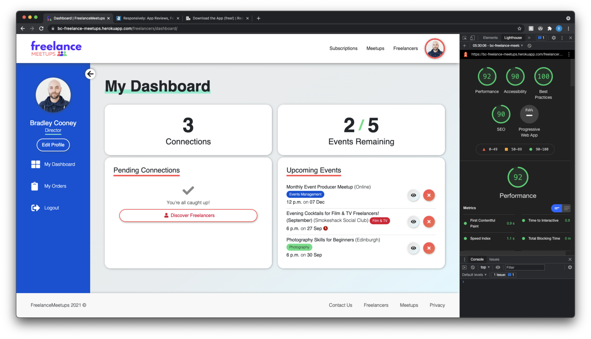

# FreelanceMeetups Testing Documentation

## Contents

- [User Stories Testing](#user-stories)
- [Technical Testing](#technical-testing)
    - [Code Validators](#code-validation)
    - [Responsive Testing](#responsive-testing)
    - [Compatability Testing](#compatibility-testing)
    - [Accessibility Testing](#accessibility-testing)
    - [Lighthouse Testing](#lighthouse-testing)
    - [Bugs & Known Issues](#bugs--known-issues)

___

### **User Stories**
The below section covers the user story testing that has taken place and evidence that the user objective has been achieved.

#### As a **first time user** I want to:
    
- <em>Be able to easily navigate the site and register before committing to a monthly subscription.</em>
- <em>Quickly identify the benefits of signing up for a paid membership.</em>
- <em>Evaluate the difference in subscriptions and best suited to my needs.</em>

Before authentication, the user can see what the site has to offer through the homepage, before requiring any payment. The homepage clearly outlines the purpose of the site, and the packages and features available:

 

#### As a returning **Freelancer** I want to:

- <em>Create a user profile so other users can find me and connect with me.</em>
- <em>Add my skills and role to my profile to highlight to other users what my expertise is and what I may have in common with them.</em>
- <em>Add my location to my profile so I can see events nearby to me vs events I would be unable to attend.</em>
- <em>Be able to hide my profile to remain anonymous to other users if I do not want to be contacted or connected with.</em>

When a user registers for a free account, they are automatically taken to the 'edit profile' page, enabling them to complete their profile information. Whilst users can navigate away from this page, they must complete this form in order for them to be visible to other users. They are notified of this by a message when the page loads.

- <em>Be able to subscribe to a monthly subscription and have access to membership only features like events and user connections.</em>
- <em>Be able to upgrade my subscription to have access to increased feature allowances such as more event attendance.</em>
- <em>Be able to downgrade my subscription to stop any further costs being charged to my credit card.</em>
- <em>Securely submit my card details when completing an order to be confident that my credit card details are stored safely in line with security best practice.</em>

When a registered user clicks navigates to 'Subscriptions', they are shown the packages available and the features within each of these. If they have an account, they are shown their current package, and the other packages are available to select.

 

If the user does not yet have a paid subscription, they are shown the card payment page, where users can securely enter their card details and confirm. This process generates a Stripe customer and subscription for the user on page load, then either attaches the package if payment is successful, otherwise destroys the Stripe customer and subscription if the page is abandoned.

 

Once the user has a paid package and Stripe subscription, any further attempts to purchase a package will inform the user that they will be upgraded and billed at the end of the month using their default payment method.

 

- <em>Be able to view my past transactions to see my previous usage and billing summary.</em>
- <em>Download invoices of my past payments	and have a copy of proof of purchase for my records.</em>

After successful purchase of the package, the user is directed to the 'My Orders' page, where they can see their previous orders, upcoming orders and downlowd any invoices. These orders are presented directly from Stripe, but attached to a server-side order, which links the order to the user for future admin reference.

- <em>Register and unregister for Meetups I am interested in.</em>
- <em>See who is attending events I am attending.</em>

Users can view the Meetups available on the 'Meetups' page accessible by the navbar and footer. This page allows users to register and unregister from events by clicking the call to action buttons on the bottom of each card. A user can see who is attending an event by clicking 'Attendees' on each card.

- <em>Connect with other users.</em>
- <em>Message other users once connected.</em>
- <em>Approve or decline connection requests sent to me.</em>

For users connecting with others, this can be done on the 'Freelancers' page. Once here, users can send a connection request to other users, accept incoming requests or if connected, send a message. To view their existing connections, users can user the filter on the Freelancers page to view these.

Users can also use the 'My Dashboard' page to accept, reject, or view more details of an incoming connection.

 

#### As a **Site Owner** I want to:

-<em> Manage users via an admin CMS.</em>
-<em> Access order details for customers.</em>
-<em> Add, edit and delete events via the site frontend.</em>

Using the Django Admin interface, admins are able to manage users - their core information, as well as toggle admin and profile visibility as required. Order details can also be accessed, but not edited.

For events, admins can add, edit and delete events directly from the Event Listings page. If the user has an `is_admin` field of `True`, then the UI will show a 'create' button at the bottom of the page, and 'edit event' on each event card. To delete an event, the user simply clicks 'delete event' on the edit modal.

-<em> Enable users to contact me if there are any issues with their account.</em>

Users can use the contact page on the footer to notify the site owner of any issues. This form will send a direct email, to which the owner can reply to.

-<em> Require users to verify their email before registration is confirmed.</em>
-<em> Only show user accounts if users have completed their profiles, so only content rich information is shown to other users.</em>

As described aboved, upon registration, users must verify their email address before they are able to login. Once logged in for the first time, they are directed to 'edit profile'. This form has validation which requires completion. Only if the form is submitted successfully will the profile visibility be switched on.

### Code Validation

The code for FreelanceMeetups has been validated through [HTML Validator](https://chrome.google.com/webstore/detail/html-validator/mpbelhhnfhfjnaehkcnnaknldmnocglk/related), [jshint](https://jshint.com/) and [Jigsaw W3 CSS Validator](https://jigsaw.w3.org/css-validator/)

- HTML Validation
    - HTML has been validated through the Chrome extension to ensure HTML includes from Django are included, and to ensure authenticated pages can be checked. 
    - The majority of errors have now been fixed and included referrer and integrity attributes in linked CSS or scripts which are not required.
    - A few warnings remain, however these are flagged when using empty icon tags when using font-awesome icons. The validator expects there to be content, but contextually this does not make sense. The same is true for modal trigger buttons where the content is an icon (the navbar). These are however aria-labelled.

- JS Hint
    - Javascript files have been validated through JS hint. A few warnings remain, predominantly regarding the use of 'let' and it's compatibility with ES6 and Mozilla.
    - In addition, since JS Hint cannot find Jquery, '$' is flagged as undefined

- W3C Jigsaw 
    - As with Javascript and HTML validation, CSS validation throws only warnings from third party links such as Bootstrap and FontAwesome.
    - There are approximately 13 Errors from the Bootstrap.min.css such as `Value Error : margin-right Parse Error .5)` and `Unknown pseudo-element or  pseudo-class ::file-selector-button [file-selector-button]`. Since these are third party applications, it is not possible to rectify these.

- Python Validation
    - Using Gitpod extensions **Python, Python Indent** and **Magic Python**, the python scripts within this site have been formatted and corrected as linting errors have occured.
    - Despite fixing the majority of issues, occasionally a linting error occurs on model classes, suggesting there is no object of that model. However, I believe this is due to the lack of context as the syntax is required for the functionality to work.
    

### Responsive Testing

Since physical devices are not available to test on at this stage, the desktop app [Responsively](https://responsively.app/download) has been used to test compatability accross mobile and tablet devices. As you can see from the screenshots below, the site is fully responsive. 

 

### **Compatability Testing**

The site has been tested across Chrome, Safari and Firefox with no difference in functionality or UI design across all pages. Since the Chrome screenshots are provided elsewhere in this documentation, the below shows the Safari and Firefox screens.

 

#### **Safari**

 

#### **Firefox**

 

### **Accessibility Testing**

The site has been tested against the [WAVE WEB AIM Accessibility Tool](https://wave.webaim.org/), specifically, using the Chrome browser extension.

With the exception of a few known contrast issues or warnings, where WAVE recognises elements using the `::after` psuedo as a font, resulting in a colour contrast warning, the pages successfully pass accessibility testing, as shown below: 

 

### **Lighthouse Testing**

Since the site is relatively lightweight, the Lighthouse tests on the most resource intensive pages (freelancer and meetups, dashboard etc) return a positive result, averaging above 90% for desktop and ranging between 60% and 90% on mobile.

An example of these results can be seen below: 

### **Bugs & Known Issues**

For the most part, the majority of bugs have been fixed, however a few remain:
- Friends App caches friends list. This causes the freelancers page to generate a error when the connection button is updated after user input, but the Database either can no longer find the other user as a friend, or believes they still exist, so will not allow the user to send them a new request for a period after. It is hoped that a fix for this will be found in future releases, or the logic refactored to allow for the caching time required.
- Currently there is no way for a user to generate a new 'verify' email link without contacting the site owner. This will cause issues if the user base grows, but for now will remain a feature for future releases.
- The site is reliant on Stripe successfully sending webhooks back to the site in order to confirm a user has paid, or if a subscription is updated and the user event count should increase. 

